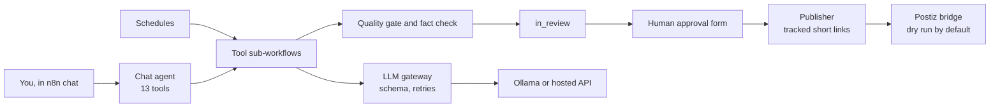

<!-- Proposed replacement for the root README.md. Links are written relative to the repo root. -->

# Local-LLM marketing agent

A marketing agent that runs on a 7B model on your own machine (Ollama, `qwen2.5:7b`),
orchestrated by n8n. You chat with it, or it works on a schedule. It plans campaigns with
measurable targets, writes posts, emails, ads and SEO briefs, **fact-checks every draft against
your approved facts**, learns from your edits, and **publishes only what a person approves**.

Writing, fact checking and the chat agent can each be moved to an OpenAI-compatible hosted
model (tested on Groq `openai/gpt-oss-120b`) with settings in `.env`. The recommended hybrid
keeps writing local and runs only the fact checker on the hosted model.

## Why it is interesting

Small local models are cheap and private, but they invent facts, drift out of format, and get
worse at picking tools as tools are added. This project treats that as an engineering problem
and measures the fixes:

- **The model lists and quotes; code decides.** The fact checker never asks the model "is this
  true?". Asked that way, the 7B model caught 3 of 13 invented claims. Made to list each detail
  and quote the evidence, with code checking the quote, it catches 53 of 55.
- **The approval gate is enforced in the workflow, not the prompt.** The agent's own tools
  cannot approve or publish, and cannot change items a reviewer approved or rejected.
- **Everything is measured with held-out sets, repeats and negative controls**, and the
  failures are published next to the wins.
- **Testing found 22 real bugs**, from n8n running HTTP calls in parallel to a cache that
  dropped the brand profile for the first minute after a reboot (caught by CI) and a hosted
  model passing its own tool-call id as a calendar item id.

## Measured results

| What | Result |
|---|---|
| Chat agent picks the right tool (24 requests, 13 tools, 3 runs) | **70/72** local now; 72/72 before the latest tool-description change |
| Fact checker, all 113 labelled claims | caught **53/55** invented, flagged 7/58 true |
| Fact checker, held-out real-post sentences | caught **5/6** invented, flagged **0/9** fine |
| Same fact check as a yes/no question (abandoned) | caught 3/13 |
| Content eval, 14 cases x 3 runs | 35/42 = 83% |
| Rewrite instruction phrased as an imperative vs a diagnosis | 6/6 vs 0/6 |
| Turning reviewer edits into rules (after a prompt fix) | 20/20 correct |

Fact checker, local `qwen2.5:7b` vs hosted Groq `openai/gpt-oss-120b`, on a held-out set
written before the run (6 invented, 6 true claims):

| What | Local | Groq |
|---|---|---|
| Invented claims caught | 5/6 | 6/6 |
| True sentences flagged | 3/6 | 1/6 |

Small sets mean wide error bars; the details and limits are in
[docs/evaluation.md](docs/evaluation.md).

## Architecture



Full diagrams (draft lifecycle, publishing and analytics, campaign loop, learning loop,
fact-check pipeline): [docs/architecture.md](docs/architecture.md).

## Quick start

```bash
./02-ollama-models/scripts/setup.sh           # local models
cd 01-marketing-stack
cp .env.example .env                           # fill the secrets and the forms login (FORMS_USER, FORMS_PASSWORD)
./scripts/preflight.sh                         # fix every FAIL
docker compose up -d --build
./scripts/import-n8n.sh                        # after creating the n8n owner account
./scripts/smoke-test.sh
```

Then open n8n, run "24 · Marketing chat agent", and try "Plan a campaign for ...". Replace the
example brand (*Northwind Roasters*, a fictional coffee subscription) in
`05-brand-service/config/brand.yaml` before real use.

Hosted options, all in `01-marketing-stack/.env`:

- **Fact checker only (hybrid):** `VERIFIER_PROVIDER=openai`, `VERIFIER_MODEL=openai/gpt-oss-120b`,
  plus `OPENAI_BASE_URL`, `OPENAI_API_KEY` and `REASONING_EFFORT=low`.
- **Writing:** `LLM_PROVIDER=openai` and `WRITER_MODEL`, with the same `OPENAI_*` settings.
- **Chat agent:** `CHAT_PROVIDER=hosted` and `CHAT_API_KEY`, then re-run `import-n8n.sh`. The
  local model stays as a fallback when the hosted API refuses (for example on a rate limit).

Whatever runs hosted sends its text (drafts, facts, chat messages) to that provider.

**Publishing:** point `PUBLISH_WEBHOOK_URL` at the Postiz bridge (54). It starts with
`POSTIZ_DRY_RUN=true`, so nothing is posted until you set it to `false`.

**Status.** Everything ran end to end on an M-series Mac with 16 GB (services under uvicorn,
n8n 2.40.5 from npm). `docker compose up` itself has not been run; the compose file validated
and every service image then in the stack was simulated from its `requirements.txt`.
The Postiz and Umami bridges are unit-tested against mocked APIs, not a live Postiz or Umami.
`preflight.sh` and `smoke-test.sh` check the real Docker run.

## Repo map

Each numbered folder is a self-contained deploy with its own README (where to deploy,
configuration, how to test). There are 56.

| Group | Deploys |
|---|---|
| Platform | 01 Docker stack, 02 Ollama models, 03 LLM gateway, 04 prompt library |
| Brand and memory | 05 brand service, 06 knowledge base |
| Research | 07 page extractor, 08 RSS, 09 change monitor, 10 keywords, 11 social listening, 12 SEO audit |
| Content tools | 13 readability, 14 platform rules, 15 UTM, 16 link shortener, 17 image cards, 18 email renderer |
| Operations | 19 content calendar, 20 analytics ingest, 21 report builder, 22 status page |
| Quality | 23 eval suite, 44 claim checker |
| The agent and its tools | 24 chat agent; 25-35 blog, social, ads, email, SEO brief, repurpose, research, keywords, calendar, knowledge answer, quality gate |
| Autonomous | 36 trend digest, 37 competitor watch, 39 publisher, 40 content planner, 41 weekly report |
| People | 38 approval form, 42 knowledge-base form, 51 rules review form |
| Campaigns | 45 campaign service, 47 plan campaign, 48 drafter, 52 daily measurement, 53 campaigns tool |
| Learning | 46 learning service, 49 revise rejected drafts, 50 weekly rule proposals |
| Publishing and analytics | 54 Postiz bridge, 55 Umami sync, 56 daily analytics sync |
| Safety net | 43 error handler |

## Documentation

| Doc | What is in it |
|---|---|
| [docs/architecture.md](docs/architecture.md) | System overview, draft lifecycle, publishing and analytics, campaign and learning loops, fact-check pipeline, local vs hosted, security measures |
| [docs/evaluation.md](docs/evaluation.md) | How quality is measured and every result, including failures |
| [docs/engineering-decisions.md](docs/engineering-decisions.md) | 17 decisions and the evidence behind each |
| [docs/bugs-found-by-testing.md](docs/bugs-found-by-testing.md) | Real bugs found, grouped, with how each was caught; security fixes |
| [START-HERE.md](START-HERE.md) | What it does, deploy order, test results |
| [BLUEPRINT.md](BLUEPRINT.md) | Every API contract |
| [CHECKPOINT.md](CHECKPOINT.md) | Build log: what was verified end to end |

## CI

`.github/workflows/ci.yml` runs the unit tests of 24 deploys (03-23 and 44-46), checks every
`NN-wf-*/workflow.json` (valid JSON, unique id, connections point to real nodes), validates
the compose file, and shellchecks the scripts. 54 and 55 are not in that test matrix yet; each
has its own `.github/workflows/ci.yml` for when it is pushed as a separate repo. Live model evals need Ollama, so they run locally or
on a self-hosted runner.
