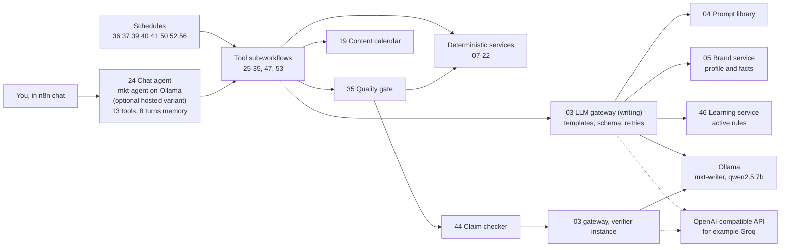
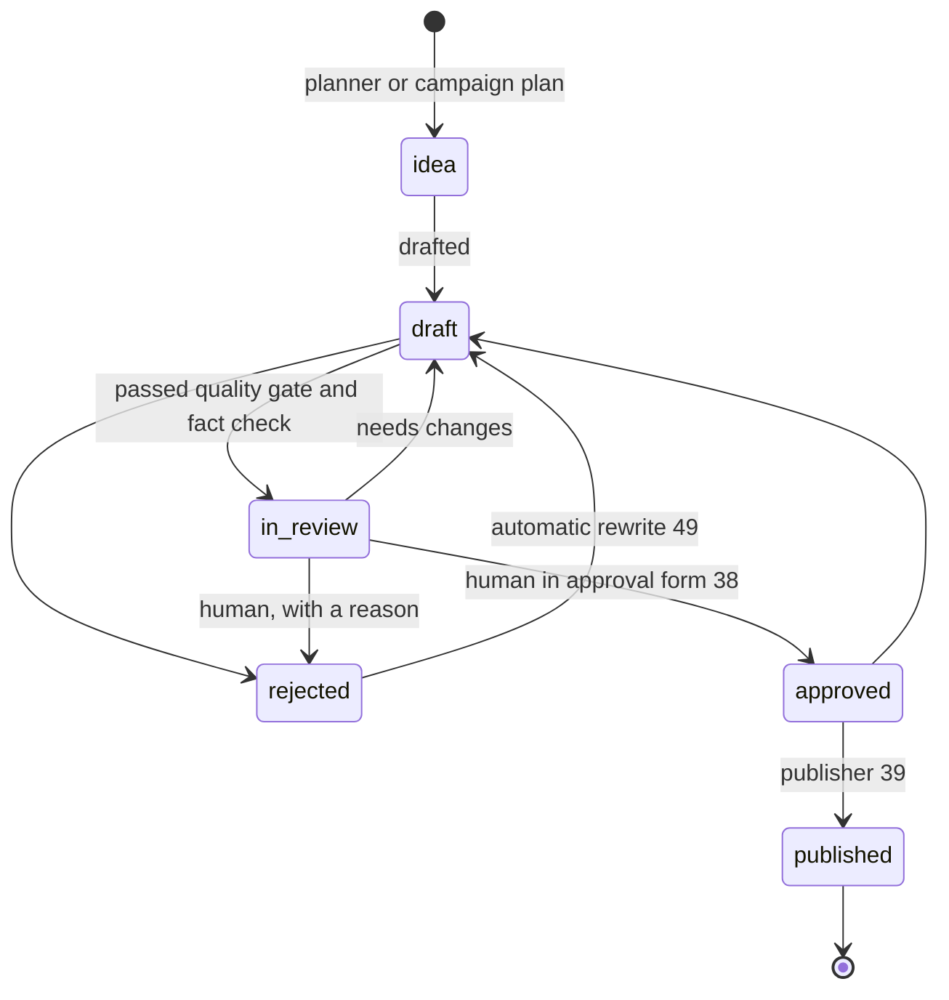
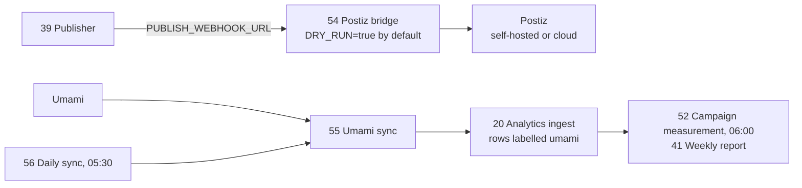
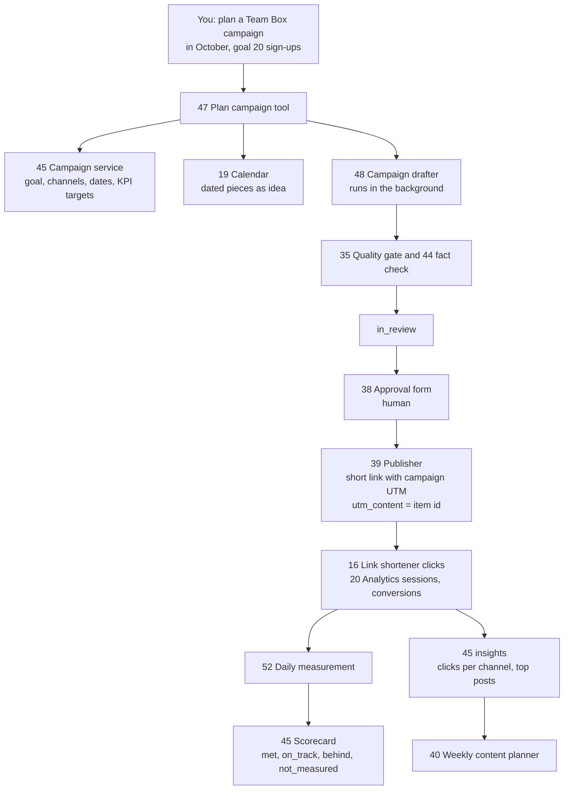
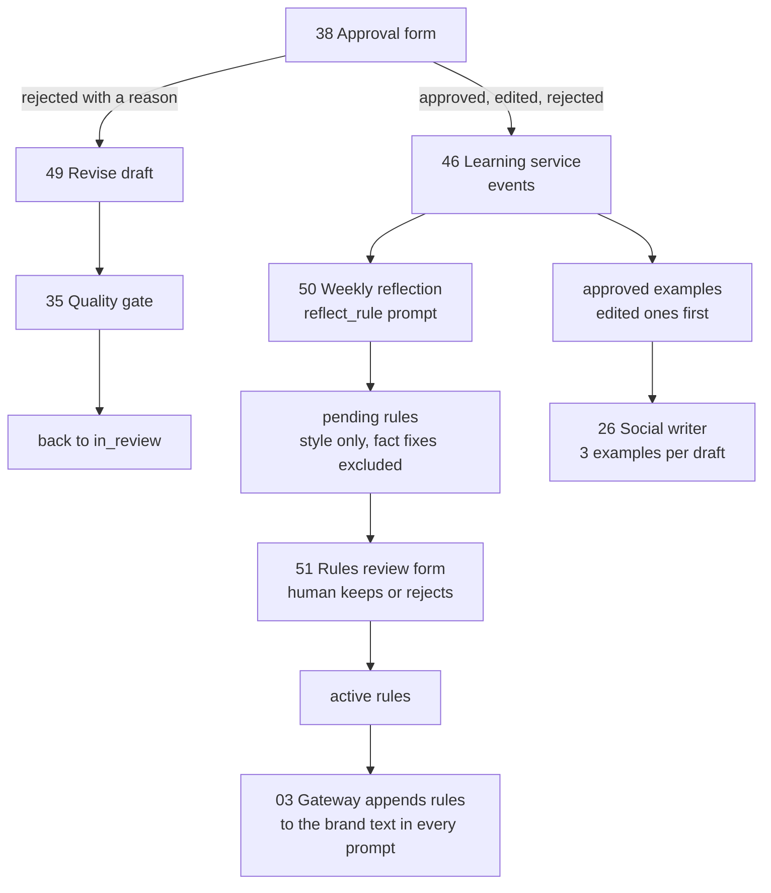
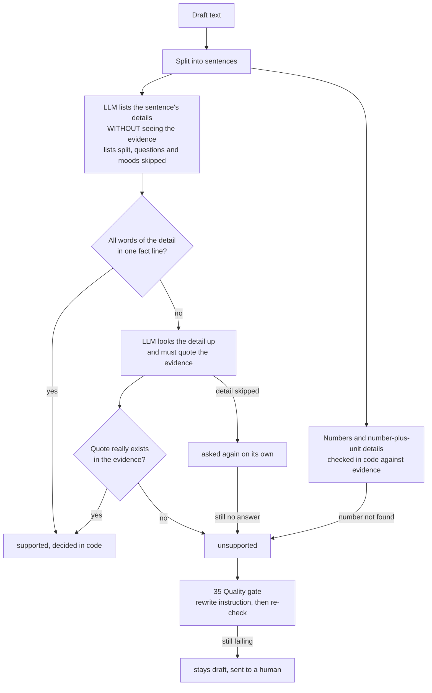

# Architecture

A marketing agent that runs on a local model (Ollama, `qwen2.5:7b`) and is orchestrated by
n8n. Parts of it can also run on any OpenAI-compatible hosted API (tested on Groq
`openai/gpt-oss-120b`): the writing gateway, the fact checker's gateway, and the chat agent
each have their own switch (see [Local or hosted](#local-or-hosted)). It is 56 small deploys:
Python services (FastAPI), n8n workflows, a prompt library, and an eval suite.

Contracts for every endpoint are in [`BLUEPRINT.md`](../BLUEPRINT.md). This page explains how
the pieces fit together.

## The design idea

A 7B local model picks tools reliably from about ten, not from forty. Everything else follows
from that:

- **The chat agent only decides what to do.** It sees 13 tools. Each tool is an n8n
  sub-workflow that does the multi-step work in a fixed order (fetch, LLM, check).
- **Every writing and checking LLM call goes through a gateway (03).** It owns the prompt
  templates (04), forces JSON with a schema, validates the result, and retries with the
  model's own error shown back to it. Small models drift out of format, so this lives in one
  place. The stack runs the gateway twice: `llm-gateway` for writing and
  `llm-gateway-verifier` for the fact checker, so checking can use a different model.
- **Deterministic work is plain code with no LLM**: page extraction, SEO checks, platform
  limits, UTM links, readability, number checks. These are cheap, unit-tested, and do not
  hallucinate.
- **Decisions that matter are made in code, not by the model**: whether a claim is
  supported, what the user's target was, which channels were requested, whether a draft may
  be approved, which calendar item an id refers to.

## System overview

The chat agent talks to Ollama directly for tool calling (`mkt-agent`, `num_ctx` 16384 so the
tool list and history are not cut off). All writing goes through the gateway (`mkt-writer`).
The dotted lines are optional: setting `LLM_PROVIDER=openai` sends the writing gateway's calls
to a hosted API, and `VERIFIER_PROVIDER=openai` does the same for the fact checker. The
workflows do not change.

### What each group does

| Group | Deploys | Role |
|---|---|---|
| Platform | 01 stack, 02 models, 03 gateway, 04 prompts | Runtime, model builds, the LLM entry point |
| Brand and memory | 05 brand, 06 knowledge base | Brand profile, banned phrases, approved facts, retrieval |
| Research | 07-12 | Page extraction, RSS, change monitor, keyword suggest, social listening, SEO audit |
| Content tools | 13-18 | Readability, platform limits, UTM, short links, image cards, email HTML |
| Operations | 19-22 | Calendar (the draft store), analytics ingest, report builder, status page |
| Quality | 23 eval suite, 44 claim checker | Measuring output, checking facts |
| Agent and tools | 24, 25-35 | Chat agent and its sub-workflows |
| Autonomous | 36, 37, 39, 40, 41 | Trend digest, competitor watch, publisher, planner, weekly report |
| People | 38, 42, 51 | Approval form, knowledge-base form, rules review form (all behind n8n Basic Auth) |
| Campaigns | 45, 47, 48, 52, 53 | Campaign object with targets, planning, drafting, measurement |
| Learning | 46, 49, 50 | Record decisions, rewrite rejected drafts, propose rules |
| Publishing and analytics | 54 Postiz bridge, 55 Umami sync, 56 daily analytics sync | Post approved items through Postiz; pull site visits and conversions from Umami |
| Safety net | 43 | Error handler posts workflow failures to a webhook |

## Draft lifecycle and the approval gate

Every piece of content is an item in the content calendar (19). The calendar enforces the
allowed status transitions; the workflows enforce who may make them.

The human gate is enforced in the workflows, not stated in a prompt:

1. **Only the approval form (38) can move an item to `approved`.** The form sits behind n8n
   Basic Auth (`FORMS_USER` / `FORMS_PASSWORD`, also used by the knowledge-base form 42 and
   the rules form 51). The calendar tool (33) that the chat agent uses refuses to set
   `approved` or `published`. Asked "approve item 2", the agent is refused.
2. **The agent cannot change reviewed items.** The calendar tool refuses `set_status` and
   `schedule` on items that are already `approved`, `published` or `rejected`: a reviewer's
   rejection can only be reopened by a person. It also accepts only a plain item number
   (`53`, `#53`, `item 53`) as an id, after a hosted model sent its own tool-call id instead.
3. **Approved items are locked.** Once `approved` or `published`, title, channel, body and link
   cannot be edited in the calendar; the item has to go back to `draft` first.
4. **The publisher (39) only reads `GET /due`**, which returns approved items whose
   `scheduled_at` has passed. It runs every 15 minutes, and marks an item published only when
   the publish endpoint answered 2xx and the answer was not a dry run.

Limit: the calendar API itself does not know who is calling. Any client with the
`INTERNAL_API_KEY` can set `approved`; the gate above is in the n8n workflows. A separate
approver key for the form is listed as open work in the build backlog.

Drafts that fail the quality gate are not hidden. They stay `draft` with the problems noted
("needs a human") instead of going to review.

## Publishing and analytics (54-56)

- **54 postiz-bridge** maps each channel to a Postiz integration (`CHANNEL_MAP`) and posts the
  text through the Postiz public API. `DRY_RUN` defaults to `true`: it validates the request
  and answers `{"status":"dry_run"}` without calling Postiz, and the publisher (39) leaves
  such items `approved` instead of marking them published. Channels that need media
  (Instagram, TikTok and others) are refused with `422`. The same `id` and channel sent again
  returns the first answer instead of posting twice (kept in memory until restart). Its
  unit tests mock the Postiz API; it has not been run against a live Postiz.
- **55 umami-sync** reads Umami one day at a time (visits and a conversion event per
  `utm_source` and `utm_campaign`) and uploads them to analytics (20) as a CSV labelled
  `umami`, so a sync never overwrites hand-uploaded rows. The Umami calls were checked against
  the Umami v3.4.0 source; its unit tests mock them.
- **56** is the n8n schedule that calls 55 for yesterday every morning, before campaign
  measurement. It is off while `UMAMI_SYNC_URL` is empty; CSV uploads keep working.

## Campaign loop

No open-source marketing tool reviewed during research held a campaign with goals and
targets. This one does (45), and it will not activate a campaign until a target is declared.

- User targets ("50 clicks") and channels are parsed and normalised in code, because the model
  rewrote both in testing.
- Only the user's goal, offer and audience count as evidence for the fact check. The
  planner's own brief does not.
- `on_track` means progress is at least the elapsed share of the campaign's days.
  `GET /report/unmeasured` lists finished campaigns with a KPI that was never measured.

## Learning loop

Every reviewer decision is recorded. Style edits become proposed rules that a human keeps or
rejects; kept rules are injected into every prompt.

Verified end to end: a style edit became the rule "Never open with a question.", was kept in
the rules form, and the gateway then fetched it for every prompt. A post with an invented
"50% off" was rejected with a reason and came back to review 22 s later with the discount
removed and the tracked link kept.

## Fact-check pipeline (44)

The claim checker never asks the model for a yes/no verdict. The model lists and quotes;
code decides.

Evidence is the brand's approved facts (05 `GET /facts`), the brief for this piece
(`context`), and knowledge-base excerpts (06) above a score threshold. Two kinds of text are
kept out of the evidence so a draft cannot approve itself:

- Knowledge-base documents from `trend-digest` and `competitor-watch` (LLM summaries of
  untrusted pages) never count (`KB_UNTRUSTED_SOURCES`).
- The repurpose tool (30) sends no `context` to the quality gate, so the pasted source text is
  checked against the facts, not used as proof of itself.

An empty model answer never counts as "all fine". When the stack sets `INTERNAL_API_KEY`,
`/verify` requires it, and input is capped (`MAX_TEXT_CHARS` 20000, `MAX_SENTENCES` 80,
at most 50 `extra_facts`), because every sentence costs model calls. Measured accuracy is in
[evaluation.md](evaluation.md).

## Local or hosted

| Part | Local (default) | Hosted switch |
|---|---|---|
| Writing gateway (`llm-gateway`) | Ollama `mkt-writer` | `LLM_PROVIDER=openai`, `OPENAI_BASE_URL`, `OPENAI_API_KEY`, `WRITER_MODEL` |
| Fact checker's gateway (`llm-gateway-verifier`) | Ollama `mkt-writer` | `VERIFIER_PROVIDER=openai`, `VERIFIER_MODEL` (shares the `OPENAI_*` settings) |
| Chat agent (24) | Ollama `mkt-agent` | `CHAT_PROVIDER=hosted` and `CHAT_API_KEY`, then re-run `import-n8n.sh` (imports `variants/hosted.json`) |
| JSON output | schema passed to Ollama as `format` | `json_schema`, falling back to JSON mode |
| Reasoning models | n/a | `REASONING_EFFORT=low` for `gpt-oss` on Groq |

The recommended hybrid is local writing with the fact checker on the hosted model: on a
held-out set the hosted checker caught more invented claims and flagged fewer true ones
(numbers in [evaluation.md](evaluation.md#local-vs-hosted-groq-openaigpt-oss-120b)).

The hosted chat variant keeps the local Ollama model as a fallback. On Groq's free tier
(8k tokens per minute) one multi-tool chat turn can hit the limit, and n8n's OpenAI node does
not retry a `429`; with the fallback, the local model finishes the turn. With the hosted
variant, chat messages and tool results go to that provider.

API keys are read only from the environment and are never logged or returned. `import-n8n.sh`
passes credentials to n8n over stdin, and n8n has no mount of the repo, so `.env` never enters
the n8n container.

## Security measures

| Measure | Where |
|---|---|
| Forms behind Basic Auth | 38, 42, 51 (credential created by `import-n8n.sh`; it refuses to run without `FORMS_USER` / `FORMS_PASSWORD`) |
| Chat agent cannot approve, publish, or change approved/published/rejected items | 33 calendar tool, in code |
| Untrusted knowledge-base sources are not fact evidence | 44 `KB_UNTRUSTED_SOURCES`; 30 sends no `context` |
| SSRF guard: private, loopback, link-local, reserved and multicast addresses refused on every redirect hop, including IPv6 forms that embed an IPv4 address (IPv4-mapped, 6to4, NAT64, IPv4-compatible) | 07, 08, 09, 12 (`app/net.py`) |
| `X-API-Key` on endpoints that cost money or overwrite state | 08 `/poll`, 09 `/check`, 44 `/verify`, plus the write endpoints of the stateful services |
| Input caps on the fact checker | 44 |
| No repo mount in n8n; credentials passed over stdin | 01 |

Not done yet (from the build backlog): an API key on the gateway's `/v1/run`, and a separate
approver key so only form 38 can set `approved` at the calendar API.

## Deployment status

Everything ran on an M-series Mac with 16 GB: services under uvicorn, n8n 2.40.5 from npm.
**`docker compose up` has not been run.** At the Phase 2 checkpoint the compose file validated
and every service image then in the stack was simulated by installing it into a clean Python
3.12 environment from its `requirements.txt` alone; all 22 answered `/health`. The
verifier gateway, 54 and 55 were added to the compose file after that simulation.
`preflight.sh` and `smoke-test.sh` check the real Docker run.

Built: Postiz (54) and Umami (55, 56) integrations. Not built: Listmonk (email).
